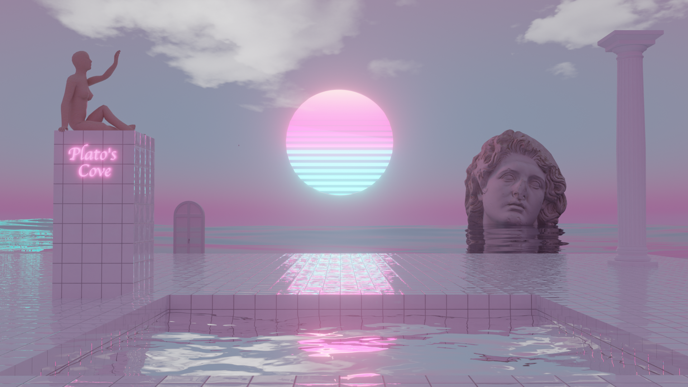

# Plato's Cove

A first-person **vaporwave 3D experience** — a liminal poolroom platform drifting on an endless ocean at golden hour, with a recessed pool, doric columns, a marble bust on a pedestal, and a boombox playing lo-fi tracks. Walk around, jump, and let the chromatic-aberrated, bloom-soaked sunset wash over you.



## The experience

- **Endless ocean** — animated `three.js` `Water` stretching to the horizon
- **Procedural sky** — custom GLSL shader with a low, hazy sun and graded vaporwave colors
- **Floating poolroom** — a tiled platform with a recessed pool of reflective water
- **Set dressing** — doric columns and a marble bust raised on a tall pedestal
- **Diegetic music** — a boombox plays vaporwave/lo-fi tracks; volume fades with your distance to it, and controls appear when you walk close
- **The door** — the freestanding door opens onto the cave: a closed-down hotel conference room where rows of empty chairs face a wall of CRTs tuned to *Plato TV*, a live broadcast of the island that cuts between shots of the sun, the statues, the pool and the door you came through, with captions, a ticker and the occasional stand-by card. The music follows you in, playing tinny out of the TVs over the room's hum and air handling
- **First-person walk camera** — custom kinematic controller with acceleration, gravity, and jumping
- **Vaporwave grade** — ACES filmic tone mapping plus bloom, chromatic aberration, film noise, and vignette

|                               |                                 |
| ----------------------------- | ------------------------------- |
|  |  |
|  |                                 |

## Tech stack

- **React 19** + **Vite 7** — fast dev server and build
- **Three.js** via **React Three Fiber** — 3D rendering
- **@react-three/drei** — R3F helpers (`useGLTF`, `Text`)
- **@react-three/postprocessing** — bloom, chromatic aberration, noise, vignette
- **vite-plugin-glsl** — imports the sky `.glsl` shaders
- **Leva** — dev-only tweak panel for lights and effects
- **Playwright** — headless screenshot capture

## Getting started

```bash
# Install dependencies
npm install

# Start development server
npm run dev
```

Then open http://localhost:3000 in your browser. Click the canvas to capture the mouse and look around.

## Controls

| Key   | Action             |
| ----- | ------------------ |
| W / ↑ | Move forward       |
| S / ↓ | Move backward      |
| A / ← | Strafe left        |
| D / → | Strafe right       |
| Mouse | Look around        |
| Space | Jump               |
| Esc   | Release mouse      |
| P     | Play / pause music |
| E     | Next track         |
| M     | Mute / unmute      |
| Click / Enter | Open a door you're facing |
| F     | Fullscreen         |

## Project structure

```
src/
├── main.tsx              # Entry point
├── App.tsx               # Canvas, camera, tone mapping, Leva panel
├── shaders/
│   ├── sky.vert.glsl     # Sky dome vertex shader
│   ├── sky.frag.glsl     # Procedural sunset / sky color
│   └── crt.*.glsl        # CRT screen: curvature, scanlines, static
└── components/
    ├── Scene.tsx         # Mounts both worlds, shows the current one; per-world
    │                     #   fog, camera near plane and acoustics
    ├── worldStore.ts     # Current world + door transition (outside Canvas)
    ├── levels.ts         # Floor height, bounds, colliders, spawns per world
    ├── DoorTrigger.tsx   # "At the door and looking at it" detection
    ├── IslandFeed.tsx    # "Plato TV": island shots + broadcast graphics for the CRTs
    ├── Effects.tsx       # Bloom, chromatic aberration, vignette, noise
    ├── player/           # First-person walk controller
    ├── island/           # Ocean, sky, platform + pool, sign, props
    ├── cave/             # Conference room, procedural carpet/wallpaper,
    │                     #   CRT video wall, chairs, EXIT sign
    ├── MusicPlayer.tsx   # Boombox: distance-based volume, proximity detection
    ├── musicStore.ts     # Tracks, play/pause/mute, Web Audio TV speaker + ambience
    └── UI.tsx            # HUD, music controls, door prompt, fade overlay

public/
├── models/               # GLB props (bust, columns, boombox, ...)
├── textures/             # PBR textures (floor tiles, pool tiles, water normals)
├── sounds/music/         # Vaporwave / lo-fi tracks
└── fonts/                # Italianno display font
```

## Screenshots & QA

A headless capture tool renders the running scene to a PNG:

```bash
npm run dev                                            # serves :3000
npm run shot -- --out screenshots/sun.png --pitch 0.05 # capture a frame
```

Appending `?qa=1` to the URL hides the Leva panel and HUD for clean captures, and `?world=cave` starts in the cave. See `scripts/shot.mjs` for all flags (`--yaw`, `--pitch`, `--x`/`--z`, `--frames`, etc.). If Playwright's bundled browser isn't installed, point `CHROMIUM_PATH` at a Chromium binary.

## Credits

### Music

all tracks generated with [Suno](https://suno.com/).

### 3D Models

- Boombox: [Retro Boombox](https://sketchfab.com/3d-models/boombox-0159214a415c49c89f85f1f336ce571a) by [ChoboiAssets](https://sketchfab.com/alsoliman905) (CC Attribution)
- Doric column: [Doric Column](https://sketchfab.com/3d-models/doric-pillar-f5be847e525e401299f2a119372edd18) by [lcoyne](https://sketchfab.com/lcoyne) (CC Attribution)
- Helios Vaporwave Bust: [Helios Vaporwave Bust](https://sketchfab.com/3d-models/helios-vaporwave-bust-f7a0fdfc6bef44b497e33257658764c8) by [fil0s0v](https://sketchfab.com/fil0s0v) (CC Attribution)
- **Textures** — tile, water-normal, and surface maps. _TODO: confirm sources/licenses._
- **Font** — [Italianno](https://fonts.google.com/specimen/Italianno) (Google Fonts, SIL Open Font License).

## License

Released under the [MIT License](LICENSE).

Note: third-party assets (music, 3D models, textures, fonts) listed above are covered by their own respective licenses, not the MIT license above.
